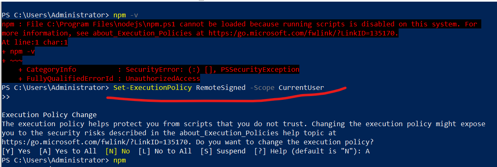

# Asterisk/FreePBX
## Asterisk failover
1. Installing pacemaker
### Troubleshooting
#### To see raw cluster configuration
```
pcs cluster cib
```
#### Check service aliveness
```
pcs status corosync 
```
#### Check whether cluster communication is happy
```
corosync-cfgtool -s
```
#### To check membership
```
corosync-cmapctl | grep members 
```
# Development
## Python
### Create virtual working environment
- In ubuntu:
```
python -m venv ttt --clear
source ttt/bin/activate
python3 -m pip install --upgrade pip
pip list
pip install torch
```
- On windows:
```
mkdir d:/test
cd test
python -m venv test 
cd test
Scripts\activate.bat
pip list
```
### How to download current python packages
```
pip freeze > requirements.txt
pip download -r requirements.txt
```
# Tools
## npm
### npm is not working in Windows after installed nodejs


In powershell, I entered this:
```powershell
Set-ExecutionPolicy RemoteSigned -Scope CurrentUser
```
## Markdown
### How to resize image
```

```
# Linux
## How to use tmux
- Split the screen: Ctrl+b %(H), "(V)
- Moving the screen: Ctrl+b arrows
- Creating a new window: Ctrl+b c
- Switching between windows: Ctrl+b n, p
- Detach: Ctrl+b d
- List tmux sessions: tmux ls
- Reattach: tmux attach -t 0
## CentOS10
### How to set yum server locally
Make /mnt/centos_iso directory and mount
```
mkdir /mnt/centos_iso
mount /dev/cdrom /mnt/centos_iso
```
(Optional) If you have .iso file
```
sudo mount -o loop /path/to/CentOS-10.iso /mnt/centos_iso
```
Set yum repository setting
```
rm -rf /etc/yum.repos.d/*.repo
vi /etc/yum.repos.d/centos-local.repo
```
Insert following to the file.
```
[BaseOS]
name=CentOS 10 - BaseOS
baseurl=file:///mnt/centos_iso/BaseOS
enabled=1
gpgcheck=0

[AppStream]
name=CentOS 10 - AppStream
baseurl=file:///mnt/centos_iso/AppStream
enabled=1
gpgcheck=0
```
### Access windows shared folder
```
yum install cifs-utils
mkdir -p /mnt/windows_share
mount -t cifs //192.168.140.217/Asterisk_Failover /mnt/windows_share/ -o username=Administrator
<Enter Password>
```
### Set history setting
```
[/etc/bashrc]
# Append each command to history file immediately
export PROMPT_COMMAND='history -a; history -n'

# Optional: Avoid duplicate entries
export HISTCONTROL=ignoredups:erasedups
shopt -s histappend     # Append to history, don’t overwrite
export HISTSIZE=10000   # Commands stored in memory
export HISTFILESIZE=20000  # Commands stored on disk
```
### Capturing using tcpdump
```
sudo tcpdump -i eth0 tcp and port 80 and host 192.168.1.1
```
### Keep rpms to cache while downloading using yum
```
[/etc/yum.conf]

keepcache=1
cachedir=/path/to/your/custom/cache/directory
```
### Download rpms with dependencies with yum
```
sudo yum install --downloadonly --downloaddir=/work/rpms/downloaded
```
### View service file
```
systemctl cat asterisk
```
### Ping only once
```
ping -c 1 192.168.122.1 
```
### SSH login without password checking
```
ssh-keygen -f ~/.ssh/id_rsa -N ""
cat ~/.ssh/id_rsa.pub  >> ~/.ssh/authorized_keys 
ssh-copy-id node-2
```
After that
```
ssh node-2 -- uname -n
```
## CentOS
### How to enable ha repository
```
sudo dnf config-manager --set-enabled highavailability
```
### Manage firewall using firewalld-cmd
```
firewall-cmd --permanent --add-service=high-availability 
firewall-cmd --reload
``` 
### Change selinux mode
```
sed -i.bak "s/SELINUX=enforcing/SELINUX=permissive/g" /etc/selinux/config 
```
## Using VPS
### How to access VPS by web http
- Install & Start cockpit
```
apt update
apt upgrade
apt install cockpit -y
systemctl enable --now cockpit
systemctl start cockpit
```
- Set firewall
```
ufw allow 9090/tcp
ufw allow 9090/udp
ufw reload
```

### How to manage virtual machines
```
apt install -y libvirt-daemon-system libvirt-clients qemu-kvm virt-manager bridge-utils cockpit-machines
```

### Port forwarding(How to ssh-connect to VPS's VM)
- VPS's IP: 65.21.136.38
- VPS's VM's IP: 192.168.122.122
- In VPS:
```shell
iptables -t nat -I PREROUTING -p tcp --dport 2222 -j DNAT --to-destination 192.168.122.122:22
iptables -I FORWARD -p tcp -d 192.168.122.122 --dport 22 -j ACCEPT
systemctl restart ufw
```
- To ssh-connect to VM
```
ssh -p 2222 root@65.21.136.38
```
# Artificial Intelligence
## Building customized chatbot
- Download llama and compile
```
git clone https://github.com/ggerganov/llama.cpp.git
cd llama.cpp
cmake -B build
cmake --build build --config Release
```
- Download model and run server
```
mkdir models
cd models
wget https://huggingface.co/TheBloke/Mistral-7B-Instruct-v0.1-GGUF/resolve/main/mistral-7b-instruct-v0.1.Q5_K_M.gguf
cd ..
build/bin/llama-server --model models/mistral-7b-instruct-v0.1.Q5_K_M.gguf --host 65.21.136.38
```
- Make chatbot app
```
curl http://65.21.136.38:8080/completion   -H "Content-Type: application/json"   -d '{ "prompt": "<|im_start|>system\nYou are an asterisk developer. Your name is Jin Jin.<|im_end|>\n<|im_start|>user\nTell me about you.< im_end|>\n<|im_start|>assistant", "n_predict": 100 }'
```
# News
## Stack Overflow Survey(2025) - Key news
- Rust, Gleam, Elixir and Zig are the most admired programming language.
- PostgreSQL is the most desired and the most admired.
- Docker is a near-universal one in cloud development.
- What is 
  - Miro, Notion in collaborative work management
- Cargo is the most admired cloud development
- Phoenix is the most admired web framework.
- uv is the most admired SO tag.
- Claude Sonnet is the most admired LLM.

- Why people prefer PostgreSQL?